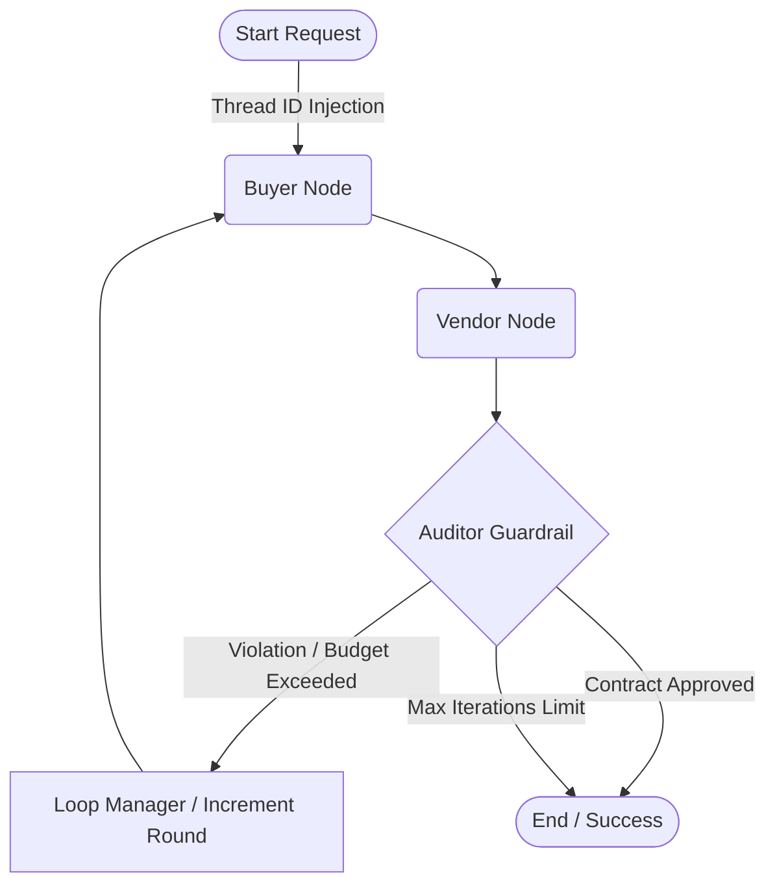

<div align="center">
  <h1>FinEdge Autonomous Procurement</h1>
  <p><strong>Enterprise-Grade Multi-Agent Negotiation Engine</strong></p>
  
  <p>
    
    
    
    
    
  </p>
</div>

## Executive Summary

**FinEdge Autonomous Procurement** is a production-ready, highly resilient Agentic AI system engineered to automate complex B2B negotiations. Moving beyond elementary heuristic chat interfaces, this architecture implements an advanced **Multi-Agent Swarm** utilizing state machines, asynchronous event loops, and LLM-driven structured orchestration to negotiate, counter-offer, and rigidly audit supply-chain contracts autonomously.

Architected according to **Senior AI Engineering standards**, this project enforces strict separation of state from business logic, robust dependency injection, deterministic guardrails, and full-stack observability.

## Technology Stack

*    **Python 3.11** - Core language execution.
*    **FastAPI** - Truly asynchronous, non-blocking API Gateway.
*    **LangGraph & LangChain** - Directed Acyclic Graph (DAG) for stateful multi-agent orchestration.
*    **LangSmith** - Complete telemetry, latency tracking, and prompt observability.
*    **PostgreSQL (pgvector)** - Serving dual purposes as both a Persistent Checkpointer and a Vector Database for Advanced RAG.
*    **Docker & Codespaces** - Fully containerized deployment with immediate remote development `devcontainer` isolation.

## Core Agentic Architecture

The negotiation lifecycle is dictated by an asynchronous State Machine traversing three distinct AI personas:

1. **The Buyer Agent:** Evaluates raw material requirements and current budget targets against the vendor's propositions. Generates aggressive counter-offers while adhering strictly to maximum thresholds.
2. **The Vendor Agent:** Simulates an external supplier, pushing back on lowball offers, referencing market constraints dynamically, and refusing specific penalty clauses.
3. **The Zero-Hallucination Auditor:** An objective, determinism-focused LLGuardrail node. It parses the final negotiated JSON object, rejecting any payload that violates internal compliance boundaries.



## Production-Grade Implementations

- **True State Persistence (Checkpointing):** Utilizing `AsyncPostgresSaver`, conversational states (`NegotiationState`) are durably committed to PostgreSQL. Transient container failures or long-running asynchronous tasks will not compromise the `Thread_ID` memory context.
- **Fail-Fast & Resilience:** LLM invocations are isolated using `Tenacity` with exponential backoff. Network instability or API rate limits trigger graceful degradation (500 Status with explicit tracing) rather than worker crashes.
- **Structured A2A Protocol:** Agents communicate exclusively via `pydantic` JSON Schemas (`price_per_unit`, `delivery_days`, `penalties`), guaranteeing reliable downstream pipeline ingestion and zero parsing errors.
- **Telemetry & Tracing (LangSmith):** Deep integration with **LangSmith** via `@traceable` decorators exposes granular metadata. Every prompt, token boundary, and latency metric across the DAG is captured for CI/CD evaluation and regression testing.

## Getting Started

### 1. Launch via GitHub Codespaces
The fastest trajectory for evaluating the Agentic flow. The repository ships with a compiled `.devcontainer`.
1. Initialize a new session in GitHub Codespaces.
2. The environment automatically orchestrates PostgreSQL, pgvector, and the Python backend.
3. Establish a `.env` configuration in the root directory:
```env
OPENAI_API_KEY=sk-...
LANGCHAIN_TRACING_V2=true
LANGCHAIN_API_KEY=ls__...
LANGCHAIN_PROJECT=finedge-procurement
DATABASE_URL=postgresql+psycopg://admin:password@db:5432/finedge
MAX_NEGOTIATION_ROUNDS=3
```
4. Execute the API layer:
```bash
uvicorn app.main:app --host 0.0.0.0 --port 8000
```

### 2. Standalone Docker Deployment
```bash
# Clone the repository
git clone https://github.com/YourUsername/finedge-autonomous-procurement.git

# Build and deploy the cluster infrastructure
docker-compose up --build -d
```
Navigate to `http://localhost:8000/docs` to interface with the `/api/v1/negotiate` endpoints via Swagger UI.
