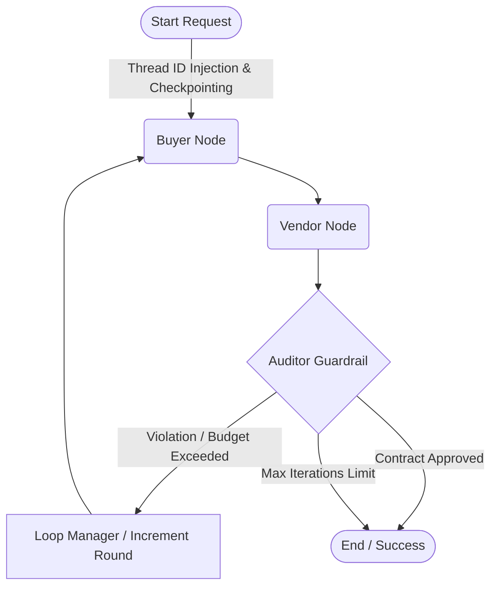

<div align="center">
  <h1>FinEdge Autonomous Procurement</h1>
  <p><strong>Enterprise-Grade Multi-Agent Negotiation Engine</strong></p>
  
  <p>
    
    
    
    
    
  </p>
</div>

## Systems Architecture Overview

**FinEdge** is a production-hardened, event-driven Agentic AI platform designed to automate high-stakes B2B supply-chain negotiations. Bypassing traditional heuristic state machines, this architecture introduces a robust **Multi-Agent Directed Acyclic Graph (DAG)**. It orchestrates decentralized LLM-driven personas (A2A protocols) to negotiate pricing, optimize delivery vectors, and enforce zero-trust compliance auditing.

Built entirely against Senior AI Engineering principles, the system inherently guarantees continuous state persistence, deterministic output schemas, and strict I/O boundary isolation for high-throughput enterprise deployments.

### Infrastructure & Technology Stack

*    **Core Runtime:** Python 3.11 optimizing asynchronous I/O overhead.
*    **API Gateway:** FastAPI delivering a unified, non-blocking ASGI interface.
*    **Agent Orchestration:** LangGraph & LangChain governing complex state mutations across LLM nodes.
*    **State & Vector Storage:** PostgreSQL with `pgvector` extension; deployed simultaneously for distributed LangGraph checkpointing and exact/semantic hybrid dense retrieval.
*    **Telemetry:** LangSmith enabling full-stack APM observability, latency tracking, and autonomous trace debugging.
*    **Containerization:** Docker & Compose for deterministic local parity and scalable CD artifact shipping.

## Core Architectural Patterns

1. **A2A (Agent-to-Agent) Orchestration:**
   - **Buyer Node:** Evaluates budgetary vectors against dynamic constraints to formulate aggressive baseline counter-offers.
   - **Vendor Node:** Predictively simulates market push-back, enforcing operational minimums and penalty rejections.
   - **Zero-Hallucination Auditor:** A determinism-enforcer node executing hard validation against strict `Pydantic` JSON schemas, rejecting any negotiated payload violating compliance logic prior to database commit.



2. **Durability via Postgres Checkpointing:**
   Conversational DAG states are durably serialized to PostgreSQL (`AsyncPostgresSaver`). Node failures, container preemptions, or horizontal scaling operations will not cause `Thread_ID` context destruction, ensuring native resume-capability and Human-in-the-loop (HITL) readiness.

3. **Fault-Tolerant Network Logic:**
   All volatile external integrations (e.g., LLM inferences) are encapsulated within `Tenacity` wrappers enforcing exponential backoff and absolute jitter strategies. Upstream API rate limits trigger graceful topological halts rather than localized container panics.

## Local Development Cluster Setup

The repository is structured to provide immediate operational parity with production environments. Follow these protocols to bootstrap the local cluster architecture.

### Prerequisites
- **Docker Engine** (v24.0+) & Docker Compose (v2.20+)
- **Git**

### Cluster Initialization

1. **Clone the Repository:**
   ```bash
   git clone https://github.com/MohamedRamadan111/finedge-autonomous-procurement.git
   cd finedge-autonomous-procurement
   ```

2. **Configure Environment Secrets:**
   Create the primary `.env` file to inject runtime keys natively into the containers.
   ```bash
   # Touch or create the .env file
   nano .env
   ```
   **Required Configuration State:**
   ```env
   OPENAI_API_KEY=sk-...                     # Core LLM Inference Provider
   LANGCHAIN_TRACING_V2=true                 # Trigger APM Telemetry 
   LANGCHAIN_API_KEY=ls__...                 # Observability Auth
   LANGCHAIN_PROJECT=finedge-a2a-engine      # Trace Project Name
   DATABASE_URL=postgresql+psycopg://admin:password@db:5432/finedge # Internal DB Pool Router
   MAX_NEGOTIATION_ROUNDS=3
   ```

3. **Bootstrap the Infrastructure:**
   Deploy the PostgreSQL/pgvector node alongside the ASGI worker containers in detached execution mode.
   ```bash
   docker-compose up --build -d
   ```

4. **Verify Telemetry & Container Health:**
   Ensure dependency resolution and database pooling succeeded implicitly without startup deadlocks.
   ```bash
   docker-compose logs -f api
   ```
   The service listener will dynamically bind to `http://localhost:8000`.

### Executing E2E Negotiation Tests

Interface directly with the Swagger OpenAPI schema (`http://localhost:8000/docs`) to trigger the state machine manually.

**Target Execution (POST `/api/v1/negotiate`):**
```json
{
  "requirement": {
    "product_name": "NVIDIA H100 GPU Cluster",
    "target_quantity": 50,
    "max_budget_per_unit": 32000.0,
    "technical_specs": "Enterprise Data Center 80GB VRAM Configuration"
  }
}
```
**Verification Check:** Retain the returned `thread_id` UUID payload. Verify the multi-agent checkpoint logic by issuing a `GET /api/v1/negotiate/{thread_id}` explicitly to confirm persistent database traversal isolation.

### Cluster Teardown
To securely halt services, release networking ports, and flush orphaned data volumes:
```bash
docker-compose down -v --remove-orphans
```
